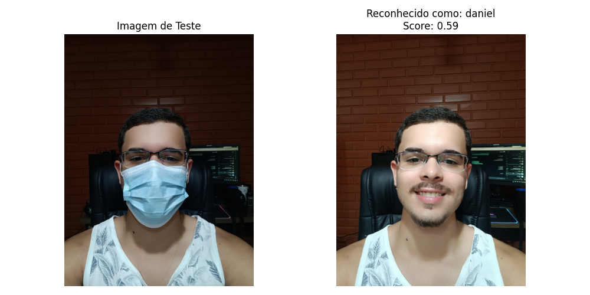

# Reconhecimento Facial com Máscara

Este projeto realiza reconhecimento facial mesmo quando o rosto está parcialmente coberto por uma máscara cirúrgica. Utiliza Visão Computacional e Metric Learning com o modelo InceptionResnetV1 (`facenet-pytorch`).

## 📂 Estrutura

```
data/
├── processed/         # Imagens base de rostos conhecidos
├── raw/               # Imagem de teste
├── embeddings/        # Cache de embeddings (gerado automaticamente)
src/
├── main.py            # Executa o reconhecimento e mostra as imagens
├── recognizer.py      # Classe principal
├── utils/             # Funções auxiliares
```

## ▶️ Como usar

1. Coloque sua imagem base (sem máscara) em:

   ```
   data/processed/seu_nome.jpg
   ```

2. Coloque a imagem com máscara em:

   ```
   data/raw/teste_mascarado.jpg
   ```

3. Execute:
   ```bash
   python -m src.main
   ```

## ✅ Resultado de exemplo

A imagem da esquerda é o rosto com máscara, e a da direita é a imagem reconhecida do banco:



---

## Requisitos

- Python 3.8+
- facenet-pytorch
- numpy
- matplotlib
- pillow
